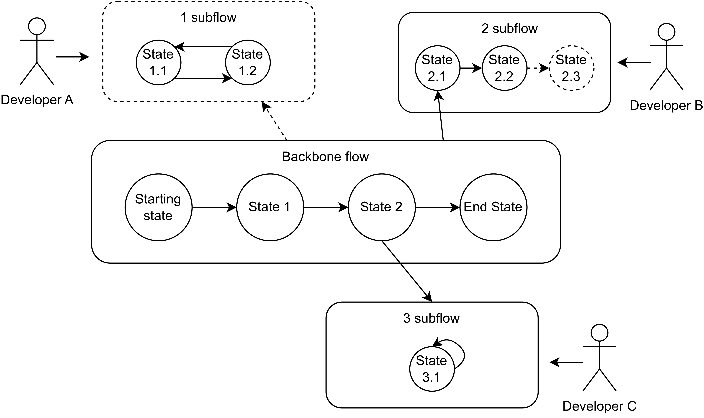
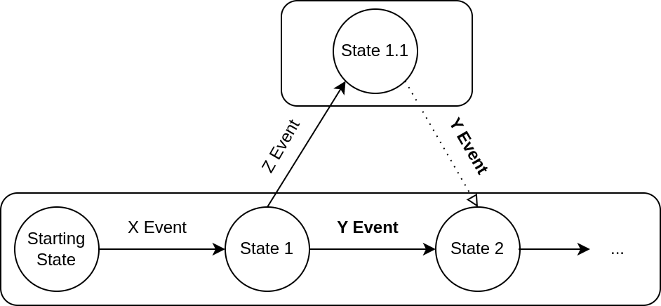

.. Dialog Manager documentation master file, created by
   sphinx-quickstart on Sun Feb 12 20:19:26 2023.
   You can adapt this file completely to your liking, but it should at least
   contain the root `toctree` directive.

TWIZ Dialog Manager Framework
==========================================

This guide will assist you in the construction of a dialog manager that facilitates the modification and extension
of its policy.

The implementation of the dialog policy adopts a state machine pattern in which it is possible to keep track of the
conversation progress and leverage it to maintain a correct conversation flow by means of state transitions.
This is an event-driven framework and the progression through its different states is triggered by events associated with
the detected intent of each user utterance, allowing for the context of a state to be used in order to provide relevant responses.

As seen in the above figure, the framework's different subflows and their composing states are organized in a highly
modular fashion, which allows for easy plug-and-play. This ensures that each subflow or state can be seamlessly integrated
or removed, without causing any disruption to the rest of the state machine.

It is important to note that the framework is designed to be able to return to the backbone of the dialog at any point of
the conversation, with no need to define additional transitions. This behavior is exemplified in the following image, where it
is possible to transition from state 1.1 to state 2 with a Y event because, after checking all the possible transitions from the state,
it checks the transitions from the backbone state it came from - state 1 - which has a transition to state 2 with the Y event.

Tree Structure
------------------

The TWIZ Dialog Manager Framework is composed of a dialog factory, events, states and response generators.

The dialog_factory is composed of:

- dialog_manager.py, responsible for dynamically creating the state machine and dealing with events.
- dialog_elements.py, which defines the patterns of this framework's composing elements.
- flows.py, used to specify all of the existing flows in the state machine.

The events folder is separated in two categories:

- intent_events, where there is a module for each event associated with an intent.
- custom_events, where there are modules for conditional events that derive from an intent, but need an additional condition to be met.

In the states folder, the states and related response generators are defined separated by flow.

.. code-block::

   .
   ├── dialog_factory
   │   ├── dialog_elements.py
   │   ├── dialog_manager.py
   │   ├── flows.py
   │
   ├── events
   │   ├── __init__.py
   │   ├── intent_events
   │   │   ├── __init__.py
   │   │   ├── GreetingIntent.py
   │   │   ├── IdentifyIntent.py
   │   │   ├── ...
   │   │
   │   ├── custom_events
   │   │   ├── __init__.py
   │   │   ├── IdentifyRecipeEvent.py
   │   │   ├── IdentifyDIYEvent.py
   │   │   ├── ...
   │
   ├── states
   │   ├── __init__.py
   │   ├── backbone
   │   │   ├── __init__.py
   │   │   ├── welcome_state.py
   │   │   ├── ...
   │   |   ├── response_generators
   │   |   │   ├── __init__.py
   │   |   │   ├── welcome_response.py
   │   |   │   ├── ...
   │   |
   │   ├── subflow_help
   │   │   ├── __init__.py
   │   │   ├── help_state.py
   │   │   ├── ...
   │   |   ├── response_generators
   │   |   │   ├── __init__.py
   │   |   │   ├── help_response.py
   │   |   │   ├── ...
   │   |
   │   ├── ...

Contents
==================
It is advised that the policy creation process adheres to the following order:

1. Creation the subflows and events
2. Creation the states
3. Definition of the states' transitions
4. Definition of the state's event handlers
5. Definition the needed response generators

The state machine should always have a BackboneFlow, which defines the desired main flow of the conversation and contains the states needed to
complete the task at hand, while the other subflows should be created as needed.

To define which state should be first triggered in the state machine, a transition from LaunchState to it should be created
(LaunchState - LaunchEvent -> YourFirstState).

A script for the creation of the first version of a state machine can be found in `here <https://github.com/irsimoes/dialog-manager-generator>`_.

Use print_dot() commented in the initialization of the dialog_manager.py to generate the configuration file of a diagram
of the state machine, that can be generated using `graphviz <https://graphviz.org/doc/info/command.html>`_.

The following sections document how each component can be created, appended or unplugged:

.. toctree::
   subflow
   event
   state
   response
   
